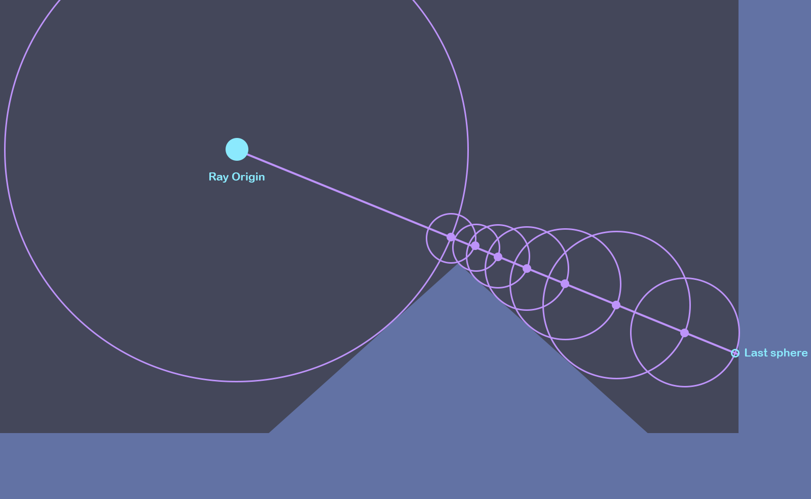

# BaseTeroid
**Baseteroid** is a game in a **_non-Euclidean space_** and written using **only a fragment
shader** with a [ShaderToy](https://www.shadertoy.com/) service. The game is heavily inspired by a popular arcade game **"Asteroid"**,
released in _November 1979_.

**You can play out game _without downloading it_ it on the shadertoy service [here](https://www.shadertoy.com/view/csS3RR)**.

### Development stages
The development stages are the following:
- **Stage 1:** Create a base game with **raymarcher** as renderer `[current stage]`
- **Stage 2:** Add a black hole visualization which will warp the space around it.
- **Stage 3:** Add black hole affected physics, which will change the gameplay

## Stage 1
- [x] Create a **raymarcher**
- [x] Handle player input
- [x] Give player inertia and movement
- [x] Make asteroids randomly spawn

#### Raymarching

_See [render.glsl](./utility/render.glsl) and [main.glsl](./main.glsl)._

**Ray marching** -  is a class of rendering methods for 3D computer graphics where rays are traversed iteratively, effectively dividing each ray into smaller ray segments, sampling some function at each step.

In a shader, it is basically launching a ray for each _texel_, and calculating the distance to hit object for each of those rays.

Raymarching "marches" using **circles**, at each iteration taking the _smallest_ distance to any object.

Whether a circle collides with some object is determined by the **signed distance functions** for those respective objects.

Lighting is also made with raymarching from object to light source and looking whether we have hit the light source or if there is something in the way.

Here is an example of a simple Raymarcher we wrote for this project:

#### The Base Game
The game is written _obviously_ in 3D, but it is entirely **top-down**, as in Asteroid but all the render is in 3D. So far it has a ship with inertia and asteroid spawning.

Here is how the game looks after the first development stage:

---

## Stage 2
- [x] Collisions and shooting system
- [x] Life System
- [x] Black hole light bending
- [x] Custom asteroid sdf

#### Collisions and shooting system

The player can collide using the sphere to sphere intersection, with the collision results being stored
in texels at runtime.

You can also shoot by pressing `"E"` (or also `"SPACE"` if you are on ShaderToy). The projectile will
destroy the upcoming asteroids.

---

#### Life System

The Player has 3 lifes, and the amount of lifes is represented by the color of the player and his projectiles:
`green`, `yellow` and `red` respectively.

You lose lifes after a collision with an asteroid, after which you have a few seconds of `cooldown protection`. After you use all your lifes you will get a `GAME OVER` screen and the
game will restart.

---

### The Black Hole

At the center of the screen there is the black hole, that `visually` bends the world around it. Here is how it works:

The black hole is positioned slightly above the player and the asteroids, that allows it to bend the rays going from the camera to the playing field. Also this allows us to **precompute** the entirely of ray travel path for layers that do not contain moving objects and that's like most of the ray path. The **precompute** allows us to achieve `60 FPS` even on wealer machines.

Here is how it looks:

---

#### Asteroid sdf

The default sphere as asteroid is a bit boring and unrealistic, right?

Well, yes, but it's fast in computing, so if we want to make a fast custom object that resembles an asteroid we will need to forget about hash fucntions and random noise and make it using simple unions and intersections of primitive shapes.

Hence, after a ton of trial and error we decided to take a union of 2 rounded cubes and call it a day:) Here it is in action:

There is also an option to turn a sphere back on by setting `#define POTATO 0` in [this file](./utility/asteroids.glsl).

Also go ahead, set `#define SUS 1` [here](./utility/asteroids.glsl), see what happens >:)

---

## Collaborators

- [Olexiy Hoev](https://github.com/alexg-lviv)
- [Ostap Trush](https://github.com/Adeon18)
- [Bohdan Ruban](https://github.com/iamthewalrus67)
- [Mykhailo Bondarenko](https://github.com/michael-2956)

### Lucky Cat :D

